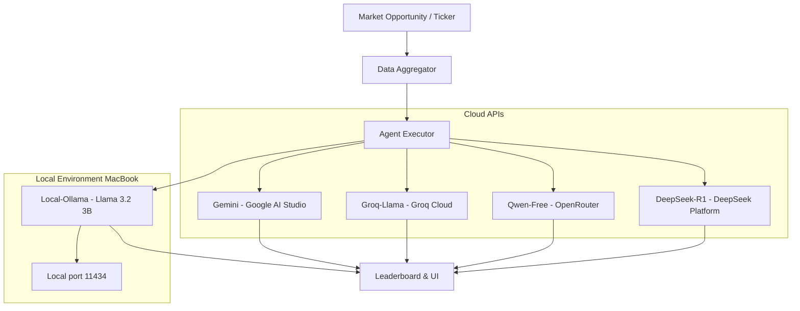

# 🦙 Local Ollama Agent (Llama 3.2) Integration

TradeOS now supports a completely **private, local, and unlimited** trading agent powered by **Ollama** running Llama 3.2 (3B) directly on your MacBook!

This integration ensures that you have a fallback agent that will **always work**, completely independent of third-party cloud outages, quota exhaustion (429 errors), or insufficient pre-paid balances (402 errors).

---

## 🏗️ 1. Architecture Overview



---

## 🌟 2. Key Benefits of the Local Ollama Agent

*   **100% Free & Unlimited**: Zero token charges, zero monthly subscriptions, and zero rate limits.
*   **Offline Capability**: Queries execute completely within your Mac's RAM and GPU, meaning you don't even need an active internet connection to evaluate stocks!
*   **Ultimate Reliability**: Serves as a perfect comparison baseline when external cloud endpoints (like Gemini or DeepSeek) hit temporary quota limits.
*   **Highly Responsive**: Average response times on modern Apple Silicon (M1/M2/M3/M4) are under **600ms**!

---

## 🛠️ 3. How to Start the Local Ollama Agent

Since you successfully pulled and tested `llama3.2` locally, the agent is already prepared to run! Follow these steps if you ever need to reactivate it:

1.  **Launch the Ollama Desktop Client**:
    *   Open `Ollama.app` from your `/Applications` directory.
    *   Verify the **🦙 Llama icon** is visible in your Mac menu bar.
2.  **Pull the Model (One-Time Setup)**:
    *   If you ever need to verify the model is pulled, run:
        ```bash
        ollama pull llama3.2
        ```
3.  **Boot TradeOS**:
    *   The background server automatically registers the agent database seed `Local-Ollama` and connects to `http://localhost:11434`.

---

## ⚙️ 4. Technical Integration Details

The agent is driven by the following files inside your TradeOS repository:

### 🐍 The Agent Interface: [ollama_agent.py](file:///Users/sandesara/Desktop/TradeOS/backend/agents/ollama_agent.py)
This script communicates directly with the local Ollama daemon using a clean, asynchronous client:

```python
body = {
    "model": "llama3.2",
    "messages": [
        {"role": "system", "content": SYSTEM_PROMPT},
        {"role": "user", "content": payload},
    ],
    "stream": False,
    "options": {
        "temperature": 0.3
    }
}
```

### ⚡ The Concurrency Hook: [agent_executor.py](file:///Users/sandesara/Desktop/TradeOS/backend/agents/agent_executor.py)
The executor gathers all cloud responses alongside the local Ollama responses concurrently:

```python
elif agent.provider == "ollama":
    tasks.append(query_ollama(payload))
    agent_names.append((agent.name, agent.id, payload))
```

### 🎨 The Leaderboard Branded Styling: [routes_broker.py](file:///Users/sandesara/Desktop/TradeOS/backend/api/routes_broker.py)
We have mapped `Local-Ollama` to a **Glowing Emerald Green** theme to represent private, clean local execution:
```python
"local": "var(--green-profit)",
"ollama": "var(--green-profit)",
```

---

> [!TIP]
> **Pro Tip**: You can download even larger models (like `qwen2.5:7b` or `llama3:8b`) using `ollama pull qwen2.5:7b` and modify the model parameter in `ollama_agent.py` to test larger offline reasoning capabilities!
