# TradeOS — Master Improvement Plan

> **Codebase scanned:** 30+ files across `agents/`, `broker/`, `data/`, `scanner/`, `scheduler/`, `database/`, `api/`, `utils/`

---

## 📊 Current Architecture Summary

```mermaid
graph TD
    A["Scheduler (trading_loop.py)"] --> B["Data Layer"]
    B --> B1["market_fetcher.py — yfinance prices/candles/OI"]
    B --> B2["news_fetcher.py — Google RSS / NewsAPI / Moneycontrol"]
    B --> B3["fundamentals_fetcher.py — yfinance .info"]
    B --> B4["data_aggregator.py — combines all"]
    A --> C["Scanner Layer"]
    C --> C1["technical_engine.py — RSI/MACD/EMA/BB/ATR/VWAP"]
    C --> C2["opportunity_scanner.py — 5 signal scanners"]
    A --> D["Agent Layer"]
    D --> D1["prompts.py — system prompt + payload builder"]
    D --> D2["gemini_agent.py — Google Gemini"]
    D --> D3["groq_agent.py — Groq Llama 3.3"]
    D --> D4["agent_executor.py — pipeline + Devil's Advocate"]
    A --> E["Broker Layer"]
    E --> E1["risk_manager.py — 16 validation checks"]
    E --> E2["virtual_broker.py — buy/short/close"]
    E --> E3["position_monitor.py — SL/TP/square-off"]
    E --> E4["eod_processor.py — daily PnL snapshot"]
```



---

## POINT 1 — Pre-Market Watchlist Filtering (50 → 10)

### Problem
[constants.py](file:///c:/Users/evanc/Desktop/TradeOS/backend/utils/constants.py) has only 13 hardcoded symbols. No dynamic filtering exists — every stock in `WATCHLIST` is scanned every cycle, wasting API calls.

### Plan

#### 1A. Expand Watchlist to 50 Stocks
| File | Action |
|------|--------|
| [constants.py](file:///c:/Users/evanc/Desktop/TradeOS/backend/utils/constants.py) | Replace 13 symbols with 50 liquid NSE F&O stocks (Nifty 50 components) |

#### 1B. Build Pre-Market Intelligence Fetcher
| File | Action |
|------|--------|
| **NEW** `data/premarket_screener.py` | Fetch for each of 50 stocks: corporate announcements (BSE/NSE RSS), earnings calendar proximity, bulk/block deals, FII/DII activity, overnight global cues, sector rotation signals |
| [news_fetcher.py](file:///c:/Users/evanc/Desktop/TradeOS/backend/data/news_fetcher.py) | Add `fetch_corporate_announcements(symbol)` using BSE RSS feeds |
| [fundamentals_fetcher.py](file:///c:/Users/evanc/Desktop/TradeOS/backend/data/fundamentals_fetcher.py) | Add `fetch_earnings_calendar(symbol)` — check if earnings within 3 days |

#### 1C. Build Stock Ranking & Filtering Engine
| File | Action |
|------|--------|
| **NEW** `scanner/premarket_filter.py` | Score each stock on: news catalyst count, earnings proximity, overnight gap %, pre-market volume, sector momentum, OI buildup. Rank all 50 and return top 10 |
| **NEW** `database/models.py` addition | Add `DailyWatchlist` model to persist today's filtered 10 stocks with scores |

#### 1D. Integrate into Trading Loop
| File | Action |
|------|--------|
| [trading_loop.py](file:///c:/Users/evanc/Desktop/TradeOS/backend/scheduler/trading_loop.py) L117 | Replace `symbols = WATCHLIST` with `symbols = get_today_filtered_watchlist()` — use pre-filtered 10 |
| [trading_loop.py](file:///c:/Users/evanc/Desktop/TradeOS/backend/scheduler/trading_loop.py) L227-322 | Update `run_pre_market_session()` to first run the 50→10 filter, THEN generate strategies only for the top 10 |

---

## POINT 2 — API Key Limit Optimization

### Problem
- Each trading cycle scans ALL watchlist stocks × ALL agents = massive API usage
- No request counting or budget tracking
- `yfinance` calls `ticker.info` (heavy endpoint) per symbol per cycle with no caching
- LLM agents make 2 calls each (Analyst + Devil's Advocate) per stock per cycle
- News fetcher hits NewsAPI for every stock even when RSS has data

### Plan

#### 2A. Centralized API Rate Limiter & Usage Tracker
| File | Action |
|------|--------|
| **NEW** `utils/api_manager.py` | Create `APIKeyManager` class: tracks per-key request counts, implements token bucket rate limiting, exposes `get_key()` / `record_usage()` / `is_exhausted()` / `get_usage_stats()` |
| **NEW** `database/models.py` addition | Add `APIUsageLog` model: `provider`, `key_hash`, `requests_today`, `tokens_used`, `last_reset`, `is_exhausted` |

#### 2B. Aggressive Caching Layer
| File | Action |
|------|--------|
| [fundamentals_fetcher.py](file:///c:/Users/evanc/Desktop/TradeOS/backend/data/fundamentals_fetcher.py) | Add 24-hour in-memory cache for `fetch_yf_fundamentals()` — fundamentals don't change intraday |
| [market_fetcher.py](file:///c:/Users/evanc/Desktop/TradeOS/backend/data/market_fetcher.py) L152-194 | Cache `fetch_option_oi_metrics()` for 15 minutes (OI updates slowly) |
| [market_fetcher.py](file:///c:/Users/evanc/Desktop/TradeOS/backend/data/market_fetcher.py) L197-238 | Cache `fetch_option_greeks_and_fii()` for 15 minutes |
| [market_fetcher.py](file:///c:/Users/evanc/Desktop/TradeOS/backend/data/market_fetcher.py) L81-123 | Cache `fetch_index_data()` for 60 seconds (called every cycle) |
| [news_fetcher.py](file:///c:/Users/evanc/Desktop/TradeOS/backend/data/news_fetcher.py) | Cache news per stock for 30 minutes — headlines don't change that fast |
| **NEW** `utils/cache.py` | Generic TTL cache decorator: `@ttl_cache(seconds=900)` |

#### 2C. Smart LLM Call Reduction
| File | Action |
|------|--------|
| [agent_executor.py](file:///c:/Users/evanc/Desktop/TradeOS/backend/agents/agent_executor.py) L53 | Make Devil's Advocate threshold dynamic — only trigger at confidence ≥ 75 (currently 65) to save 1 API call on marginal signals |
| [trading_loop.py](file:///c:/Users/evanc/Desktop/TradeOS/backend/scheduler/trading_loop.py) L119-172 | Add pre-filter: skip LLM calls for stocks with no signal from technical scanner (RSI 40-60, no volume spike, no pattern) — pure noise |
| [agent_executor.py](file:///c:/Users/evanc/Desktop/TradeOS/backend/agents/agent_executor.py) | Batch yfinance calls using `yf.download()` for all symbols at once instead of per-symbol `yf.Ticker()` |

#### 2D. Refactor All Agents to Use APIKeyManager
| File | Action |
|------|--------|
| [gemini_agent.py](file:///c:/Users/evanc/Desktop/TradeOS/backend/agents/gemini_agent.py) | Replace local `_current_key_index` rotation with centralized `APIKeyManager.get_key("gemini")` |
| [groq_agent.py](file:///c:/Users/evanc/Desktop/TradeOS/backend/agents/groq_agent.py) | Same — use `APIKeyManager.get_key("groq")` |
| [news_fetcher.py](file:///c:/Users/evanc/Desktop/TradeOS/backend/data/news_fetcher.py) | Same — use `APIKeyManager.get_key("newsapi")` |

---

## POINT 3 — Advanced Trading Algorithms & Strategies

### 3A. Missing Technical Indicators
| File | Action |
|------|--------|
| [technical_engine.py](file:///c:/Users/evanc/Desktop/TradeOS/backend/scanner/technical_engine.py) | Add: **Supertrend** (7,3), **Ichimoku Cloud** (9,26,52), **Stochastic RSI**, **OBV** (On Balance Volume), **ADX** (trend strength), **Fibonacci retracement** levels from swing high/low |

### 3B. New Scanner Strategies for LONG
| File | Action |
|------|--------|
| [opportunity_scanner.py](file:///c:/Users/evanc/Desktop/TradeOS/backend/scanner/opportunity_scanner.py) | Add these new scanners: |

- **VWAP Reclaim** — Price drops below VWAP, reclaims it on volume > 1.5x → BUY
- **Opening Range Breakout (ORB)** — First 15-min candle range breakout on volume → BUY
- **Gap-and-Go** — Gap up > 1% with volume confirmation → BUY
- **Fibonacci Bounce** — Price bounces off 61.8% retracement level → BUY
- **Supertrend Flip** — Supertrend turns bullish from bearish → BUY
- **Ichimoku Breakout** — Price breaks above Kumo cloud → BUY
- **Accumulation Signal** — OBV divergence (price flat, OBV rising) → BUY

### 3C. New Scanner Strategies for SHORT
| File | Action |
|------|--------|
| [opportunity_scanner.py](file:///c:/Users/evanc/Desktop/TradeOS/backend/scanner/opportunity_scanner.py) | Add these SHORT scanners: |

- **VWAP Rejection** — Price tests VWAP from below, gets rejected on volume → SHORT
- **Opening Range Breakdown** — First 15-min low break on volume → SHORT
- **Gap-and-Fade** — Gap up > 2% but reverses with bearish candle → SHORT
- **Supertrend Flip Bearish** — Supertrend turns bearish → SHORT
- **Ichimoku Breakdown** — Price drops below Kumo cloud → SHORT
- **Distribution Signal** — OBV divergence (price rising, OBV falling) → SHORT
- **Double Top / Head & Shoulders** — Pattern recognition using pivot points → SHORT

### 3D. Advanced Risk & Position Management
| File | Action |
|------|--------|
| [position_monitor.py](file:///c:/Users/evanc/Desktop/TradeOS/backend/broker/position_monitor.py) | Add **trailing stop-loss** — move SL up when price moves in favor by 1× ATR |
| [position_monitor.py](file:///c:/Users/evanc/Desktop/TradeOS/backend/broker/position_monitor.py) | Add **partial profit booking** — close 50% at partial_exit_1 price (already in prompt output, not implemented) |
| [position_monitor.py](file:///c:/Users/evanc/Desktop/TradeOS/backend/broker/position_monitor.py) | Add **time-based decay exit** — reduce confidence threshold by 5 every hour position is open without hitting target |
| [risk_manager.py](file:///c:/Users/evanc/Desktop/TradeOS/backend/broker/risk_manager.py) | Add **correlation check** — block new positions if > 3 stocks from same sector are already open |
| [risk_manager.py](file:///c:/Users/evanc/Desktop/TradeOS/backend/broker/risk_manager.py) | Add **Kelly Criterion** position sizing as alternative to fixed % |
| [virtual_broker.py](file:///c:/Users/evanc/Desktop/TradeOS/backend/broker/virtual_broker.py) | Add **partial close** method for 50% exit at partial_exit_1 |

### 3E. Enhanced AI Prompt Engineering
| File | Action |
|------|--------|
| [prompts.py](file:///c:/Users/evanc/Desktop/TradeOS/backend/agents/prompts.py) | Add new indicators to payload: Supertrend, Ichimoku, Stochastic RSI, OBV, ADX |
| [prompts.py](file:///c:/Users/evanc/Desktop/TradeOS/backend/agents/prompts.py) | Add **sector correlation context** to system prompt |
| [prompts.py](file:///c:/Users/evanc/Desktop/TradeOS/backend/agents/prompts.py) | Add **earnings proximity warning** to checklist |
| [prompts.py](file:///c:/Users/evanc/Desktop/TradeOS/backend/agents/prompts.py) | Add **gap analysis** rules (gap up/down handling) |

### 3F. Financial Research Models
| File | Action |
|------|--------|
| **NEW** `scanner/quant_models.py` | Implement: **Z-Score mean reversion** model, **Momentum factor** (12-1 month returns), **Relative Strength** ranking across watchlist, **Volatility breakout** (Donchian channel), **Pair trading** correlation detector |

### 3G. Edge Cases to Handle
| File | Edgecase |
|------|----------|
| [agent_executor.py](file:///c:/Users/evanc/Desktop/TradeOS/backend/agents/agent_executor.py) | AI returns quantity > available lot multiples for F&O |
| [agent_executor.py](file:///c:/Users/evanc/Desktop/TradeOS/backend/agents/agent_executor.py) | AI returns entry_price far from current market (stale price) — add 2% price deviation check |
| [virtual_broker.py](file:///c:/Users/evanc/Desktop/TradeOS/backend/broker/virtual_broker.py) | Handle stock splits / bonus adjustments on positions |
| [position_monitor.py](file:///c:/Users/evanc/Desktop/TradeOS/backend/broker/position_monitor.py) | Handle market holidays (NSE calendar) — don't square off on non-trading days |
| [risk_manager.py](file:///c:/Users/evanc/Desktop/TradeOS/backend/broker/risk_manager.py) | Handle circuit limit stocks (upper/lower circuit = can't exit) |
| [market_fetcher.py](file:///c:/Users/evanc/Desktop/TradeOS/backend/data/market_fetcher.py) | Handle yfinance returning NaN/None for delisted or suspended stocks |
| [trading_loop.py](file:///c:/Users/evanc/Desktop/TradeOS/backend/scheduler/trading_loop.py) | Handle concurrent cycle execution (currently has `is_running_cycle` flag but no timeout) — add 5-min timeout |
| [prompts.py](file:///c:/Users/evanc/Desktop/TradeOS/backend/agents/prompts.py) | AI returning SHORT with position_type=LONG (mismatch) — add strict validation |
| [eod_processor.py](file:///c:/Users/evanc/Desktop/TradeOS/backend/broker/eod_processor.py) | Missing `max_drawdown` calculation — implement high-water mark tracking |

---

## POINT 4 — Pipeline Reliability Fixes

### Current Pipeline Bugs Found

| # | Bug | File | Line(s) |
|---|-----|------|---------|
| 1 | **FII/DII data is hardcoded** — `fii_net = 1450.0` is static, not fetched live | [market_fetcher.py](file:///c:/Users/evanc/Desktop/TradeOS/backend/data/market_fetcher.py) | L200-201 |
| 2 | **`days_to_earnings` is hardcoded to 5** — never actually calculated | [market_fetcher.py](file:///c:/Users/evanc/Desktop/TradeOS/backend/data/market_fetcher.py) | L227 |
| 3 | **`opportunity_scanner.py` is never called** in trading_loop — the loop builds opportunities manually, bypassing all 5 scanner strategies | [trading_loop.py](file:///c:/Users/evanc/Desktop/TradeOS/backend/scheduler/trading_loop.py) | L146-153 |
| 4 | **`decision` dict missing `symbol` key** when passed to risk_manager — causes `_check_per_stock_daily_limit` to silently pass | [agent_executor.py](file:///c:/Users/evanc/Desktop/TradeOS/backend/agents/agent_executor.py) | L220 |
| 5 | **No market holiday calendar** — scheduler runs on all weekdays including Diwali, Republic Day, etc. | [trading_loop.py](file:///c:/Users/evanc/Desktop/TradeOS/backend/scheduler/trading_loop.py) | L93 |
| 6 | **DeepSeek agent seeded in DB but has no query function** — will crash if activated | [main.py](file:///c:/Users/evanc/Desktop/TradeOS/backend/main.py) | L45 |
| 7 | **`eod_processor.py` is duplicated** — both `trading_loop.py:run_end_of_day()` and `eod_processor.py:run_end_of_day()` exist | [eod_processor.py](file:///c:/Users/evanc/Desktop/TradeOS/backend/broker/eod_processor.py) | entire file |
| 8 | **COMPANY_NAME_MAP is incomplete** — only 5 of 13 watchlist stocks have mappings for news fetching | [news_fetcher.py](file:///c:/Users/evanc/Desktop/TradeOS/backend/data/news_fetcher.py) | L94-100 |
| 9 | **`market_hours` bypass in risk_manager** — `_check_market_hours` always returns `passed: True` (L318) | [risk_manager.py](file:///c:/Users/evanc/Desktop/TradeOS/backend/broker/risk_manager.py) | L318 |

### Fix Plan

| # | Fix | File |
|---|-----|------|
| 1 | Scrape FII/DII data from moneycontrol RSS or NSDL | `data/market_fetcher.py` |
| 2 | Use yfinance earnings calendar to compute actual days_to_earnings | `data/market_fetcher.py` |
| 3 | Integrate `OpportunityScanner.scan_all()` INTO the trading loop as a pre-filter | `scheduler/trading_loop.py` |
| 4 | Inject `decision["symbol"] = opportunity["symbol"]` before risk validation | `agents/agent_executor.py` |
| 5 | Add NSE holiday calendar (hardcoded list + API fallback) | **NEW** `utils/market_calendar.py` |
| 6 | Create `agents/deepseek_agent.py` with proper API client | **NEW** file |
| 7 | Delete `eod_processor.py`, consolidate into `trading_loop.py` | `broker/eod_processor.py` |
| 8 | Auto-generate company names from symbol: `symbol.replace(".NS","").replace(".BO","")` already exists as fallback — expand the map for all 50 stocks | `data/news_fetcher.py` |
| 9 | Re-enable market hours check properly with override flag | `broker/risk_manager.py` |

---

## POINT 5 — API Key Exhaustion Email Notifications

### Plan

#### 5A. Email Service
| File | Action |
|------|--------|
| **NEW** `utils/email_notifier.py` | SMTP email sender using Gmail App Password or SendGrid. Functions: `send_admin_alert(subject, body)`, `send_api_exhaustion_alert(provider, key_hash, details)` |
| [.env](file:///c:/Users/evanc/Desktop/TradeOS/backend/.env) | Add: `ADMIN_EMAIL`, `SMTP_HOST`, `SMTP_PORT`, `SMTP_USER`, `SMTP_PASSWORD` |
| [config.py](file:///c:/Users/evanc/Desktop/TradeOS/backend/config.py) | Add email config fields |

#### 5B. Integration Points
| File | Action |
|------|--------|
| [gemini_agent.py](file:///c:/Users/evanc/Desktop/TradeOS/backend/agents/gemini_agent.py) L95 | After "All Gemini API keys exhausted" → call `send_api_exhaustion_alert("Gemini", ...)` |
| [groq_agent.py](file:///c:/Users/evanc/Desktop/TradeOS/backend/agents/groq_agent.py) L119 | After "All Groq API keys exhausted" → call `send_api_exhaustion_alert("Groq", ...)` |
| [news_fetcher.py](file:///c:/Users/evanc/Desktop/TradeOS/backend/data/news_fetcher.py) L91 | After "All NewsAPI keys exhausted" → call `send_api_exhaustion_alert("NewsAPI", ...)` |
| `utils/api_manager.py` (new) | Centralized hook: when any provider's ALL keys are exhausted → trigger email |

#### 5C. Throttle Notifications
| File | Action |
|------|--------|
| `utils/email_notifier.py` | Add cooldown: max 1 email per provider per hour to prevent spam |
| **NEW** `database/models.py` addition | Add `AlertLog` model to track sent notifications |

#### 5D. Admin Dashboard Alert
| File | Action |
|------|--------|
| **NEW** `api/routes_alerts.py` | `GET /api/alerts/recent` — returns last 24h of API exhaustion events |
| [main.py](file:///c:/Users/evanc/Desktop/TradeOS/backend/main.py) | Register the alerts router |

---

## 🎯 Execution Priority Order

| Phase | Points | Effort | Impact |
|-------|--------|--------|--------|
| **Phase 1** | Point 4 (Pipeline Fixes) | ~3 hours | 🔴 Critical — bugs will cause wrong trades |
| **Phase 2** | Point 2 (API Optimization) | ~4 hours | 🔴 Critical — burning keys fast |
| **Phase 3** | Point 5 (Email Notifications) | ~2 hours | 🟡 Important — need visibility |
| **Phase 4** | Point 1 (50→10 Filter) | ~4 hours | 🟡 Important — smarter stock selection |
| **Phase 5** | Point 3 (Advanced Algos) | ~8 hours | 🟢 High value — better trade quality |

> **Total estimated effort: ~21 hours of development**

---

## New Files to Create

```
backend/
├── data/premarket_screener.py      # Point 1 — Pre-market data fetcher
├── scanner/premarket_filter.py     # Point 1 — 50→10 ranking engine
├── scanner/quant_models.py         # Point 3 — Quantitative models
├── agents/deepseek_agent.py        # Point 4 — Missing agent
├── utils/api_manager.py            # Point 2 — Centralized key manager
├── utils/cache.py                  # Point 2 — TTL cache decorator
├── utils/email_notifier.py         # Point 5 — SMTP notifications
├── utils/market_calendar.py        # Point 4 — NSE holiday calendar
├── api/routes_alerts.py            # Point 5 — Alert API endpoints
```

## Existing Files to Modify

```
backend/
├── utils/constants.py              # Expand to 50 stocks
├── data/market_fetcher.py          # Fix hardcoded data + add caching
├── data/news_fetcher.py            # Expand company map + caching
├── data/fundamentals_fetcher.py    # Add earnings calendar + caching
├── scanner/technical_engine.py     # Add 6 new indicators
├── scanner/opportunity_scanner.py  # Add 14 new strategies
├── agents/agent_executor.py        # Fix symbol injection + edge cases
├── agents/gemini_agent.py          # Use APIKeyManager + email hook
├── agents/groq_agent.py            # Use APIKeyManager + email hook
├── agents/prompts.py               # Enhanced prompt with new indicators
├── broker/risk_manager.py          # Fix market hours + add correlation
├── broker/position_monitor.py      # Trailing SL + partial exits
├── broker/virtual_broker.py        # Partial close method
├── scheduler/trading_loop.py       # Integrate filter + fix scanner
├── database/models.py              # 3 new models
├── config.py                       # Email config
├── .env                            # Email credentials
├── main.py                         # Register alerts router
```
